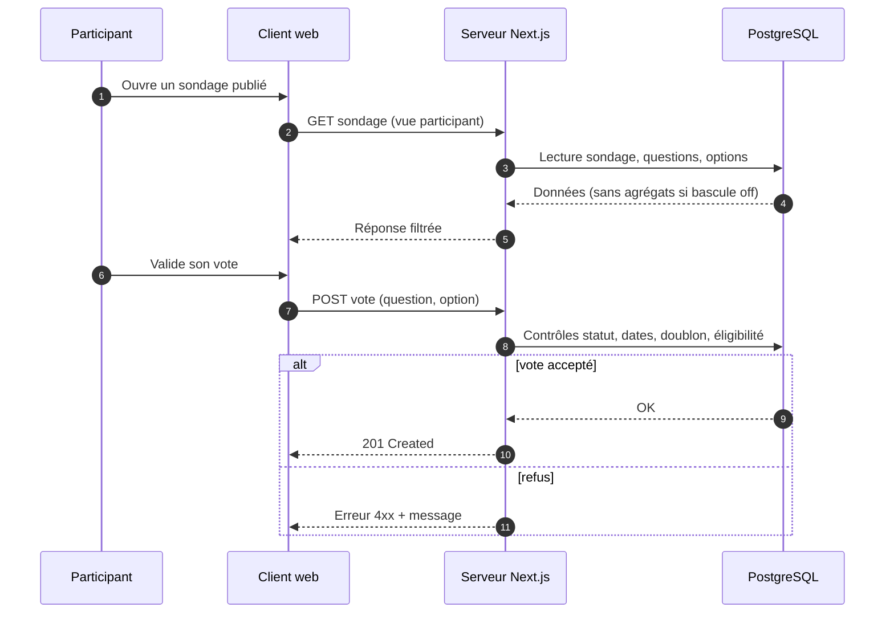
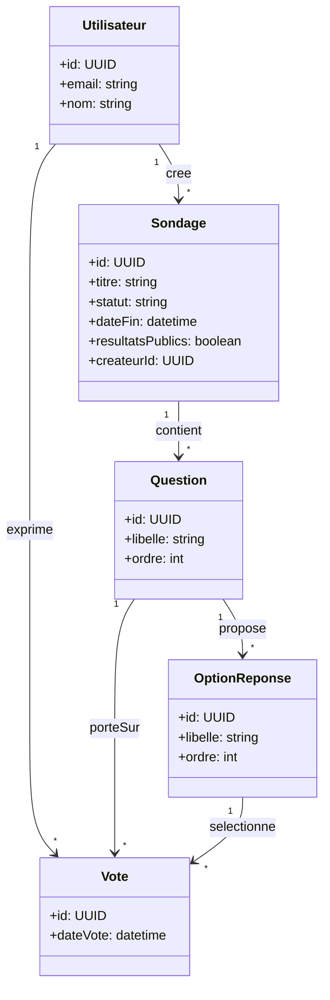

# Sond'age — Conception

## 1. Reformulation du besoin client

### Contexte

Équipe d’environ 40 développeurs ; besoin de sondages internes pour arbitrer des sujets collectifs.

### Problème

Si les résultats sont visibles trop tôt ou sans contrôle, les votes encore possibles sont biaisés par la tendance déjà affichée.

### Objectif

Fournir une application web conçue **desktop first** où :

- l’organisateur crée, publie et clôt les sondages ;
- les users votent sur les sondages ouverts ;
- l’organisateur décide explicitement si tous les participants peuvent voir les résultats agrégés ou non (bascule « résultats visibles pour tout le monde » activée ou désactivée).

### Accès à l’application

L’utilisateur s’enregistre ou se connecte avec son **nom** et son **adresse e-mail** uniquement, **sans mot de passe** (mode de preuve côté technique : lien ou code envoyé par e-mail — voir §6).

### Règle simple

Un utilisateur devient **organisateur du sondage qu’il crée** ; sur les autres sondages, il est user comme les autres (sauf évolutions futures).

### Critères de succès

- Vote simple tant que les résultats ne sont pas « libérés ».
- Quand l’organisateur active la visibilité, tous les users concernés voient les **mêmes** agrégats.
- L’organisateur voit **toujours** les résultats pour préparer la synthèse.

---

## 2. Personas

### Persona 1 — Camille, animatrice de sondages

- **Profil** : développeuse ou Scrum Master ; propose souvent des arbitrages à l’équipe.
- **Comportement** : se connecte avec nom + e-mail ; crée le sondage, le publie, suit les votes ; consulte les résultats ; active la bascule quand tout le monde doit voir les mêmes agrégats.
- **Objectif** : décision collective sans biais au moment du vote, puis transparence partagée au bon moment.
- **Frustration** : outils où tout le monde voit les scores trop tôt.

### Persona 2 — Samir, participant

- **Profil** : développeur IC ; crée parfois un sondage, mais surtout répond aux sondages des autres.
- **Comportement** : même mode d’accès nom + e-mail ; repère les sondages ouverts, vote vite ; ne voit pas les agrégats tant que l’organisateur n’a pas libéré les résultats ; sur **ses** sondages, il agit comme organisateur (bascule, clôture).
- **Objectif** : donner son avis sans être influencé ; voir les résultats comme tout le monde une fois autorisé.
- **Frustration** : UI confuse ou scores visibles avant d’avoir voté.

---

## 3. User stories (MoSCoW)

| ID   | User story | MoSCoW |
|------|------------|--------|
| US0  | En tant que **visiteur ou utilisateur**, je veux **m’enregistrer ou me connecter** avec mon **nom** et mon **e-mail**, **sans mot de passe**, afin d’**accéder** à l’application. | **Must** |
| US1  | En tant qu’**utilisateur connecté**, je veux **créer un sondage** (titre, questions, options) afin de devenir **organisateur de ce sondage** et collecter des avis structurés. | **Must** |
| US2  | En tant qu’**organisateur du sondage**, je veux **publier** le sondage et définir une **période de vote** (ex. date de fin) afin que les participants sachent quand ils peuvent voter. | **Must** |
| US3  | En tant que **participant** à un sondage ouvert, je veux **voter** ; tant que les résultats ne sont pas « libérés pour tous », je ne dois **pas** voir les résultats agrégés. | **Must** |
| US4  | En tant qu’**organisateur du sondage**, je veux **activer ou désactiver** la bascule « résultats visibles pour tout le monde » afin de contrôler le moment où **tous** les participants voient les **mêmes** agrégats. | **Must** |
| US5  | En tant qu’**organisateur du sondage**, je veux **consulter à tout moment** les résultats agrégés afin de préparer la synthèse ou la réunion. | **Must** |
| US6  | En tant qu’**organisateur du sondage**, je veux **clôturer** le sondage afin de figer les votes et clarifier la fin de la consultation. | **Should** |

> Si l’énoncé impose **exactement 6** stories : fusionner **US0** dans l’intro (§1 Accès) et retirer la ligne **US0** du tableau.

---

## 4. Critères d’acceptation (Gherkin)

### Connexion sans mot de passe (nom + e-mail)

```gherkin
Scénario: Accès avec nom et e-mail sans mot de passe
  Étant donné que je suis sur l'écran d'inscription ou de connexion
  Quand je saisis mon nom et mon adresse e-mail
  Et je valide (sans champ mot de passe)
  Alors le système m'authentifie ou poursuit le flux sans mot de passe (ex. lien ou code envoyé par e-mail)
  Et j'accède à l'application une fois le flux terminé
```

### Critère 1 — Création = organisateur du sondage

```gherkin
Scénario: Créer un sondage me désigne comme organisateur de ce sondage
  Étant donné que je suis authentifié
  Quand je crée un sondage avec un titre, au moins une question et des options
  Et que je l'enregistre
  Alors je suis l'organisateur de ce sondage
  Et je peux publier, clôturer et activer la visibilité des résultats pour tous sur ce sondage uniquement
```

### Critère 2 — Bascule « résultats pour tous »

```gherkin
Scénario: Activation de la visibilité des résultats pour tous
  Étant donné que je suis l'organisateur du sondage
  Et qu'il existe au moins un vote
  Quand j'active la bascule "résultats visibles pour tout le monde"
  Alors tout participant éligible voit les mêmes résultats agrégés sur ce sondage
```

### Autres critères (texte)

E-mail unique ; pas d’agrégats côté participant tant que la bascule est désactivée ; un vote par question ; plus de vote après date de fin ou clôture ; seul l’organisateur publie, bascule et clôt.

---

## 5. Spécifications fonctionnelles

### But

Application web **desktop first** : sondages, votes, pilotage de la divulgation des résultats agrégés.

### Accès

Inscription / connexion avec **nom** + **adresse e-mail** uniquement, **sans mot de passe** ; l’e-mail sert à identifier l’utilisateur et à valider l’accès (lien ou code — détail impl. §6).

### Acteurs

- **Organisateur** = utilisateur qui **a créé** le sondage (droits **uniquement** sur ce sondage).
- **Participant** = utilisateur **éligible** qui vote ; sur les **autres** sondages, le créateur d’un sondage est user comme les autres.

### Fonctions

Accès (nom + e-mail, sans mot de passe) → créer / modifier **brouillon** → **publier** (date de fin de vote) → **voter** (choix unique, **un vote** par question et par personne) → **clôturer** (plus de votes) → l’organisateur **voit toujours** les agrégats → bascule « résultats visibles pour tout le monde » : si **on**, tous les participants voient les **mêmes** totaux / % ; si **off**, pas d’agrégats côté participants.

### Règles clés

Seul l’organisateur publie, clôt et gère la bascule ; après date de fin ou clôture, **pas** de nouveau vote ; la bascule ne concerne que l’**affichage** des résultats côté participants, pas le droit de l’organisateur de consulter les agrégats.

---

## 6. Spécifications techniques

### Versions

- **Node** 22 LTS (ou 20 LTS)
- **Next.js** 16.1.x · **React** 19.x · **TypeScript** 5.x
- **Better Auth** 1.6.x + **PostgreSQL** 16 ou 17
- **Docker** + Compose v2 · **ORM** : Prisma 6 ou Drizzle (un seul choix équipe)

### Architecture

Next.js monolithique : UI React + règles métier **côté serveur** (créateur = organisateur, bascule résultats, votes, anti-doublon). Better Auth avec adapter Postgres ; cookies **httpOnly**, **Secure** en prod.

### Auth sans mot de passe

Même si l’écran ne demande que **nom** + **e-mail**, le serveur doit **prouver la possession de l’e-mail** : par ex. **magic link** ou **code à usage unique** envoyé par e-mail (plugin / stratégie Better Auth compatible). Le **nom** est stocké pour l’affichage ; l’**e-mail** est l’identifiant stable (unique).

### Déploiement

`docker-compose` : app Next + Postgres (volume persistant), Postgres **non exposé** sur Internet. **VPS** Linux + proxy **HTTPS** (Caddy/Nginx) vers le conteneur app ; **SMTP** (ou service mail) pour l’envoi des liens / codes.

### Sécrets

`DATABASE_URL`, secret Better Auth, URL de l’app, configuration **SMTP** (ou clé API mailer) → variables d’environnement uniquement.

---

## 7. Cas d’utilisation

**Acteurs (rappel)** : visiteur ; utilisateur connecté (**nom** + **e-mail**, sans mot de passe) ; **organisateur** = créateur du sondage ; **participant** = éligible au vote.

| ID | Cas d’utilisation | Acteur |
|----|-------------------|--------|
| **CU01** | S’inscrire ou se connecter (**nom** + **e-mail**, preuve par lien ou code e-mail) | Visiteur |
| **CU02** | Créer / modifier un sondage **brouillon** | Utilisateur → organisateur de ce sondage |
| **CU03** | **Publier** (avec date de fin de vote) | Organisateur du sondage |
| **CU04** | **Voter** (une fois par question) | Participant |
| **CU05** | **Voir les résultats agrégés** (organisateur : toujours ; participant : si bascule « pour tous » activée) | Organisateur / participant |
| **CU06** | **Activer ou désactiver** la bascule « résultats visibles pour tout le monde » | Organisateur du sondage |
| **CU07** | **Clôturer** le sondage (plus de votes) | Organisateur du sondage |

**Erreurs / refus (synthèse)** : actions réservées à l’organisateur refusées aux autres ; vote impossible si non publié, déjà voté, clôturé ou après la date de fin ; pas d’agrégats côté participant si la bascule est off.

---

## 8. Diagrammes UML

### 8.1 Diagramme de séquences — **Voter** sur un sondage ouvert

*(Participant authentifié ; le serveur refuse si le sondage n’est pas publié, si la date est dépassée, si déjà voté, etc. Les agrégats ne sont pas renvoyés côté participant tant que la bascule « résultats pour tous » est désactivée.)*



### 8.2 Diagramme de classes — **Domaine sondage**


